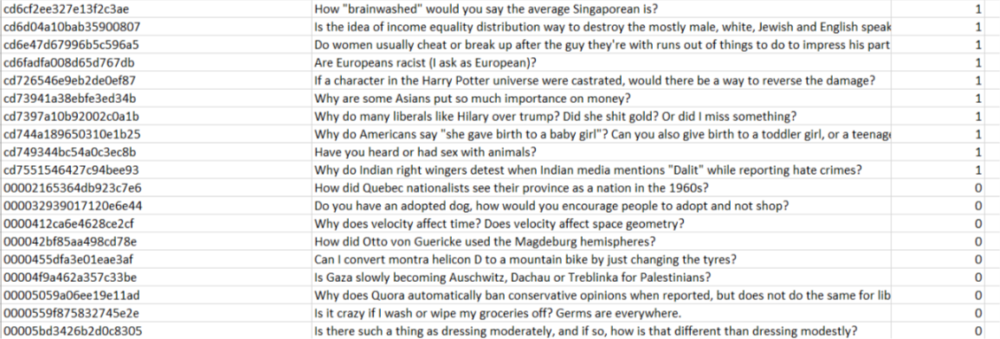

# Quora Insincere Question Classification
 Kaggle competition to classify insincere questions asked in quora using machine learning models.
 
### Python dependencies necessary to import:

```
from google.colab import drive
import pandas as pd
import zipfile
import numpy as np 
from tqdm import tqdm
import math
from sklearn.model_selection import train_test_split
from keras.models import Sequential
from keras.layers import CuDNNLSTM, Dense, Bidirectional, Dropout
from keras import backend as K

```


### Dataset: https://www.kaggle.com/c/quora-insincere-questions-classification/data
### GloVe Embeddings: http://nlp.stanford.edu/data/glove.840B.300d.zip

### Dataset Description
  Train and test data are stored in two separate csv files in text format. We load them in pandas dataframe.
  
  ```
  trainDf=pd.read_csv("train.csv")
  ```

  
##### Train Data 
1.31 million questions are labelled either as insincere or not by 1 and 0 respectively. Each question
  has a unique id. Each row consists of three columns: qid, question_text, target.
  
##### Test Data
As test data provided in kaggle is not labelled, we split the training data into training, test and validation 
sets by 60, 20 and 20 percents using train_test_split from scikit learn.
```
trainDf, valDf = train_test_split(trainDf, test_size=0.4)
valDf, testDf = train_test_split(valDf, test_size=0.5)
```

### Steps
 *Convert texts into word vectors using glove embeddings.*
 ```
 def readEmbeddings(embeddingsFile):
    tempDict={}
    f=open(embeddingsFile)
    for line in tqdm(f):
        values=line.split(" ")
        word=values[0]
        vect=np.asarray(values[1:],dtype='float32')
        tempDict[word]=vect
    f.close()
    return tempDict
embeddingsDict=readEmbeddings('glove.840B.300d.txt')

vectDim=300
numOfVect=30

def textToArr(txt):
    zeroVect=np.zeros(vectDim)
    txt=txt[:-1].split()[:numOfVect]
    embeds=[embeddingsDict.get(x,zeroVect) for x in txt]
    embeds+=[zeroVect]*(numOfVect-len(embeds)) 
    return np.array(embeds)

valVects = np.array([textToArr(x) for x in tqdm(valDf["question_text"])])
valY = np.array(valDf["target"])

 ```
 *Define f1 accuracy metrices*
```
def f1(y_true, y_pred):
    def recall(y_true, y_pred): 
        true_positives = K.sum(K.round(K.clip(y_true * y_pred, 0, 1)))
        possible_positives = K.sum(K.round(K.clip(y_true, 0, 1)))
        recall = true_positives / (possible_positives + K.epsilon())
        return recall

    def precision(y_true, y_pred): 
        true_positives = K.sum(K.round(K.clip(y_true * y_pred, 0, 1)))
        predicted_positives = K.sum(K.round(K.clip(y_pred, 0, 1)))
        precision = true_positives / (predicted_positives + K.epsilon())
        return precision
    precision = precision(y_true, y_pred)
    recall = recall(y_true, y_pred)
    return 2*((precision*recall)/(precision+recall+K.epsilon()))

```
 
*Create keras LSTM model to fit the data.*

```
model = Sequential()
model.add(Bidirectional(CuDNNLSTM(64, return_sequences=True), input_shape=(30, 300)))
model.add(Dense(1, activation="sigmoid"))
model.compile(loss='binary_crossentropy', optimizer='adam', metrics=['accuracy',f1])

batchSize = 128
def batchGenerate(train_df):
    numBatches = math.ceil(len(train_df) / batchSize)
    while True: 
        train_df = train_df.sample(frac=1.)   
        for i in range(numBatches):
            texts = train_df.iloc[i*batchSize:(i+1)*batchSize, 1]
            textArr = np.array([textToArr(text) for text in texts])
            yield textArr, np.array(train_df["target"][i*batchSize:(i+1)*batchSize])

bg = batchGenerate(trainDf)
model.fit_generator(bg, epochs=20, steps_per_epoch=1000, validation_data=(valVects, valY), verbose=True)
```
### Results

```
score = model.evaluate(testVects, testY, batch_size=1024, verbose=1)
print(model.metrics_names[0],":",score[0])
print(model.metrics_names[1],":",score[1])
print(model.metrics_names[2],":",score[2])

```
loss : 0.34119263452378307
acc : 0.949490474080638
f1 : 0.5371880054262607 
  
